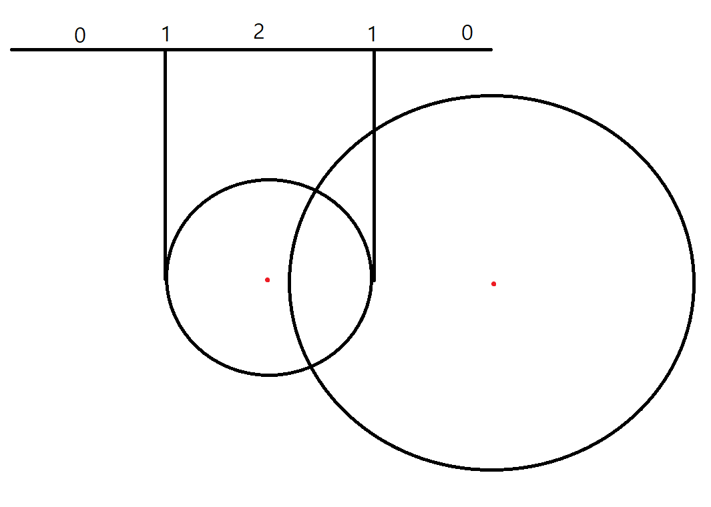

[https://www.acmicpc.net/problem/1002](https://www.acmicpc.net/problem/1002)

## 문제 소개

두 원의 중심 좌표와 반지름이 주어졌을 때 만나는 점의 개수를 구하는 문제이다.

## 문제 풀이

두 원의 중심 간의 거리인 `d`를 계산하고 `d`의 값에 따라 조건을 나누어 점의 개수를 찾는다.

* **`d`가 0인 경우 :** 두 원은 동심원이다.
   1. `r1`과 `r2`가 같다면 두 원은 완전히 겹치므로 `-1`을 출력한다.
   2. `r1`과 `r2`가 다르다면 두 원은 만나는 점이 없으므로 `0`을 출력한다.
* **`d`가 0이 아닌 경우 :** 아래 그림으로 간단히 생각해 볼 수 있다.
   {: w="500" } 
   1. `r1 + r2 > d`라면 `d`와 `max(r1, r2)`, `min(r1, r2)`끼리의 간단한 연산으로 두 원이 만나는 점이 몇 개인지 알 수 있다. 위 그림의 숫자 5개 중 왼쪽의 0, 1, 2의 경우에 해당한다.
   2. `r1 + r2 == d`라면 위 그림에서 왼쪽에서 4번째에 있는 1의 경우에 해당한다. 한 점에서 만나게 된다.
   3. `r1 + r2 < d`라면 위 그림에서 맨 오른쪽의 0의 경우에 해당한다. 어느 점에서도 만나지 않으므로 `0`을 출력해야 한다.
      

## 코드

```python
import sys
import math
input = lambda: sys.stdin.readline().rstrip()

t = int(input())
for _ in range(t):
    x1, y1, r1, x2, y2, r2 = map(int, input().split())
    d = math.sqrt((x2 - x1) ** 2 + (y2 - y1) ** 2)

    if d == 0:
        if r1 != r2:
            print(0)
        else:
            print(-1)
    else:   # d > 0
        if r1 + r2 > d:
            if d - min(r1, r2) < max(r1, r2) < d + min(r1, r2):
                print(2)
            elif max(r1, r2) == d + min(r1, r2):
                print(1)
            else:
                print(0)
        elif r1 + r2 == d:
            print(1)
        else:   # r1 + r2 < d
            print(0)
```
