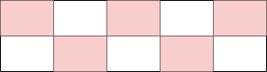
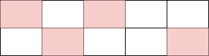

[https://www.acmicpc.net/problem/9465](https://www.acmicpc.net/problem/9465)

## 문제 소개

테스트 케이스의 개수 `t`가 주어지고, 각 테스트 케이스마다 정수 `n`과 2행 `n`열의 스티커 점수 정보가 주어진다.

스티커는 떼어내면 그 스티커의 상하좌우에 위치한 스티커들은 사용할 수 없게 된다.

떼어낼 스티커들을 선택해서 획득하는 점수의 합이 최대가 되도록 하는 문제이다.

## 문제 풀이

### 접근

선택된 스티커와 인접한 스티커는 사용하지 못하므로 한 열에서는 1행의 스티커와 2행의 스티커 둘 중 하나만 선택할 수 있으며, 이전 열에서 선택한 행을 이번 열에서는 선택하지 못한다.

`n`이 5일 경우, 스티커를 최대한 많이 선택하는 방법을 단순하게 생각해 보면 아래와 같다.

{: w="500" } 

그러나 이 방법은 최대의 점수를 보장하지는 않는다. 그 이유는 아래의 방법의 점수 합이 더 클 수 있기 때문이다.

{: w="500" } 


**1**열부터 **n**열까지 순서대로 스티커를 선택한다고 생각했을 때, (스티커를 선택하지 않고 건너뛴 열이 있을 수 있음) 특정 열까지 선택한 상태에서의 점수의 최대치를 `dp`로 
구할 수 있다.

### 해결

`dp`로 풀이하였다.

**x**열까지 선택했다고 가정했을 때, 마지막으로 **1**행을 선택한 경우와 **2**행을 선택한 경우의 점수의 최대값을 각각 **dp[x][0]**, **dp[x][1]** 이라고 하면 아래 식이 성립한다.

```python
# arr[x][y]는 x행 y열의 점수 값이다
dp[x][0] = max(dp[x - 1][1], dp[x - 2][0], dp[x - 2][1]) + arr[0][x]
dp[x][1] = max(dp[x - 1][0], dp[x - 2][0], dp[x - 2][1]) + arr[1][x]
```

위 식을 토대로, 실제 풀이에서는 별도의 dp 리스트를 사용하지 않고 점수 값 리스트에 값을 누적시키는 방식으로 값을 도출하였다.

`n`이 1인 경우, 2인 경우, 그 외 경우로 나누어서 코드를 작성하였다.

## 코드

```python
from sys import stdin
input = lambda: stdin.readline().rstrip()


# 점수 게산 함수
def cal_score(n, arr):
    if n == 1:
        return max(arr[0][0], arr[1][0])
    elif n == 2:
        return max(arr[1][0] + arr[0][1], arr[0][0] + arr[1][1])
    else:
        arr[0][1] += arr[1][0]
        arr[1][1] += arr[0][0]
        # 반복을 통한 dp 수행
        for i in range(2, n):
            arr[0][i] += max(arr[1][i - 1], arr[0][i - 2], arr[1][i - 2])
            arr[1][i] += max(arr[0][i - 1], arr[0][i - 2], arr[1][i - 2])
        return max(arr[0][n - 1], arr[1][n - 1])


t = int(input())
for _ in range(t):
    n = int(input())
    arr = [list(map(int, input().split())) for _ in range(2)]
    print(cal_score(n, arr))

```
