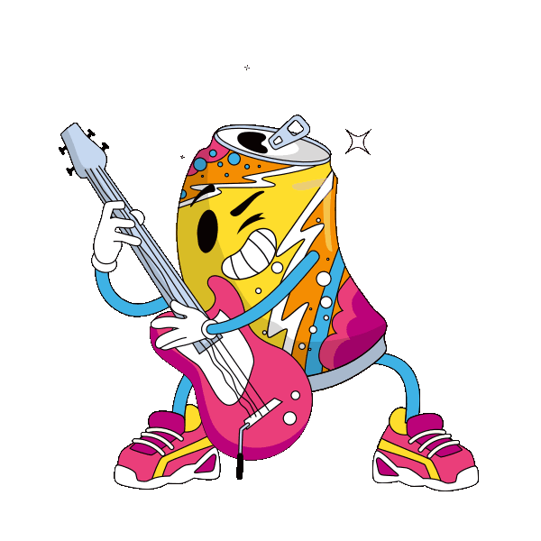

- 이슈: [ThorVG #4669](https://github.com/thorvg/thorvg/issues/4669)
- PR: [ThorVG #4685](https://github.com/thorvg/thorvg/pull/4685)

## 증상

[1편]()에서 팔레트 색상 문제가 어느정도 해결되었다고 생각했었지만, 여전히 정확한 색상을 표현하지 못하는 문제가 드러났다.

사실 [이전 PR](https://github.com/thorvg/thorvg/pull/4655)을 준비하면서 팔레트 덤프를 시각화했을 때 **중복 색상 엔트리**가 많다는 것은 인지하고 있었고, 개선을 염두에 두고 있었다. 다만 gif가 255개보다 적은 색상을 사용하는 케이스에서도 여전히 문제가 발생하고 있다는 것은 예상하지 못했다. (테스트한 gif의 표본 수가 적었던 탓도 있다)

## 문제 인식

1편의 작업에서는 k-d tree 구성 시 픽셀을 언제나 절반으로 분할하는 것이 아닌, 값을 기반으로 분할함으로써 동일한 색상의 픽셀이 서로 다른 하위 트리로 분리되지 않도록 하였다. 이를 통해 문제의 부분적인 개선이 이루어졌지만, 여전히 한계가 존재했다. 팔레트는 여전히 무조건 절반으로 분할되고 있었던 것이다.

예를 들어 전체 픽셀 중 95%가 검은색(`#000000`)이고 5%가 흰색(`#ffffff`)이라고 했을 때, 첫 분할을 통해 전체 팔레트 수의 절반은 검은색을 배정받고 나머지 절반은 흰색을 배정받는다. 다시 말하면 팔레트의 분할은 실제 픽셀 색상 값의 빈도와 무관하게 언제나 절반으로 이루어지고 있다는 것을 의미한다.

극단적인 경우, 어떤 팔레트 엔트리에는 하나의 색상만이 배정되어 있는 반면 다른 엔트리에는 수많은 색상이 평균으로 뭉개져 들어갈 수 있다. 또한 중복된 색상들이 팔레트 대부분을 채우게 된다. 색상이 중복 없이 하나씩만 들어가게 한다면 훨씬 다양한 색상을 나타낼 수 있을 것이다.

## 알고리듬 선택

해결책은 명확했다. "팔레트를 실제 색상 개수를 기반으로 분할하자". 하지만 그리 단순하지는 않은게, [gif-h](https://github.com/charlietangora/gif-h)를 기반으로 하는 원본 코드가 k-d tree 생성 시 픽셀 집단과 팔레트 집단을 언제나 절반으로 분할하던 것에 나름대로의 이유가 있었기 때문이다.

gif-h의 팔레트 생성 방식은 **median-cut** 알고리듬을 구현한 것으로 *Paul Heckbert*가 1982년 발표한 논문을 기반으로 하고 있었다. 결과 k-d tree는 언제나 깊이 8의 균형 이진 트리가 되었기 때문에 빠른 탐색 시간을 보장했다. 하지만 이 방식은 2020년대 기준으로 보면 색상 정확도 면에서 한계가 있다.

대안에 대해 조사해본 결과, *Xiaolin Wu*가 1991년 소개한 분산 기반 분할 방식이 괜찮아보였다. 하지만 Wu의 알고리듬은 3D 색상 히스토그램을 기반으로 하는 방식을 요구했기에, **경량성**을 주요 목표로 삼는 ThorVG에게는 다소 무겁다고 판단했다.

이에 대한 절충안으로 [SSE (Sum of Squared Errors)](https://en.wikipedia.org/wiki/Residual_sum_of_squares)를 기반으로 분할하는 방식을 도입했다. Wu의 방식보다 메모리가 적게 들면서도 어느 정도의 정확성을 보여줄 수 있기 때문이다.

## 설계

- 팔레트 집단은 이제 절반으로 분할되지 않는다. 각 집단은 Box라고 불리며, 매 분할마다 SSE가 가장 큰 Box가 선정되어 분할된다.
- 하지만 팔레트 집단을 절반이 아닌 비율로 나누게 되면 기존에 언제나 균형 이진 트리가 생성되었던 것과는 달리 불균형한 트리가 생성될 수 있다. 이는 탐색 시 병목을 야기할 수 있다.
- 기존 구조는 분할하면서 해당 상태를 그대로 트리 형태로 저장하고, 이를 탐색 자료구조로 사용한다. 이 방식은 '분할하면서 생성할 자료구조'와 '탐색에 사용할 자료구조'가 같도록 강제한다. 이 구조를 탈피한다면 불균형하게 분할하는 것과는 별개로 탐색 단계에서는 균형 이진트리를 사용할 수도 있다.
- 이를 달성하기 위해 팔레트 생성 함수인 `_makePalette`를 두 단계(phase)로 나누었다.

### 1. Color quantization

- 팔레트에 들어갈 최대 255개의 색상을 선정하는 단계.
- 가장 큰 SSE를 가진 Box를 분할한다. 분할축은 squared error가 가장 큰 축이다.
- 분할 지점도 SSE를 사용하여 정밀하게 수행할 수 있지만, 여기선 median value를 사용해도 충분하다고 판단했다.

### 2. k-d tree construction

- 1 단계에서 얻은 색상 목록을 기반으로 별도의 k-d tree를 생성한다. 이는 균형 이진 트리로, 탐색에서의 속도를 보장한다.
- 가장 범위가 큰 축에 대해 절반으로 분할하는 것을 반복한다. (정확히는, 중앙값을 히스토그램 기반으로 찾아 splitVal로 사용한다)
- 이때 주의점으로, 분할하기 전 색상들은 세 가지 그룹으로 분할되어야 한다
  - splitVal보다 작은 그룹, splitVal과 값이 같은 그룹, splitVal보다 값이 큰 그룹
  - Dutch National Flag (DNF) 알고리듬을 통해 수행되었다.

## 결과

[ThorVG Example](https://github.com/thorvg/thorvg.example) 리포에 있는 151개의 Lottie 중, 수정 전후로 확연한 차이가 존재하는 4개의 파일을 선정했다.

| file | rendering (before) | rendering (after) |
| --- | --- | --- |
| traveling.json (frame 521) |  |  |
| ghost.json (frame 0) |  |  |
| guitar.json (frame 6) |  |  |
| train.json (frame 0) |  |  |

## 성능

사실상 1편에서 했던 작업의 연장선에 있었기 때문에, PR 본문에서 언급을 하지 않을 수 없었다. main과 비교하면 성능 하락이 있지만, [ThorVG #4655](https://github.com/thorvg/thorvg/pull/4655)의 적용 이전과 비교하면 성능에 향상이 있다고 보고했다. (자세한 내용은 PR 본문 참고)

또한 **callgrind** 분석 결과 `_getClosestPaletteColor()` 함수에서 더 많은 재귀 호출이 일어나기도 했는데, 이는 이번 수정을 통해 더욱 다양한 색상이 k-d tree의 leaf node에 존재하게 되어 탐색 자체가 더 깊은 곳으로 자주 들어가기 때문이다.

## 후기

코드베이스 분석, 그리고 ThorVG에서 사용하기에 적절한 방식 & 알고리듬을 선정하는 데에 적지 않은 시간이 걸렸던 것 같다. 근데 생각보다 머지도 빨리 되고, 반응도 괜찮은 것 같아서 기분이 좋았다.

[저번 PR](https://github.com/thorvg/thorvg/pull/4655)을 작업했을 때에는 성능에 영향을 줄 수 있는 작업임에도 불구하고 성능 측정을 내가 따로 하지 않아 멘토님께서 대신 코멘트에 달아주셨는데, 이번에는 내가 직접 진행해서 표를 첨부했다. 아마 리뷰하시면서 직접 따로 테스트를 진행하시겠지만, 작성자가 먼저 분석해서 데이터를 제공하는 것에는 의미가 있다고 본다.

Git과 GitHub를 이용한 협업에도 조금씩 익숙해지고 있는 것 같고, 이슈를 해결하는 과정에서 해당 모듈에 대해 상당히 빠른 속도로 구조를 파악하는 연습도 되었다.
